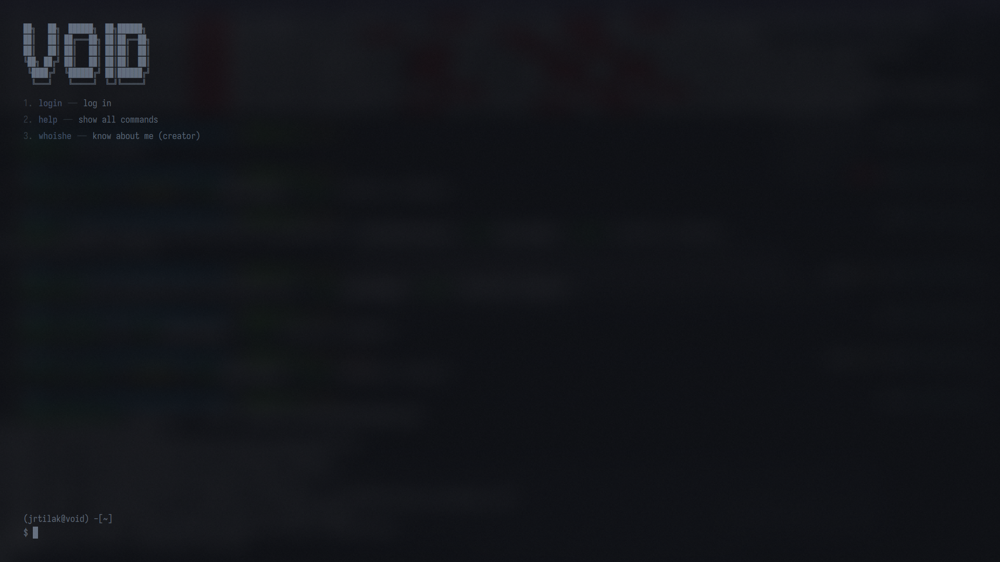

# Void

**Void** is an [SDDM](https://github.com/sddm/sddm) login theme that looks like a terminal. You type commands (`help`, `login`, `whoami`, …), see output scroll above, and enter your password when you run `login`. Colors, fonts, blur, and layout are controlled from `theme.conf` so you can tune the look without editing QML unless you need to change behavior.



> This theme was thrown together with **Cursor** (“vibecoded”). I’m not a QML expert—it’s here because **it works on my machine**, not because every distro or SDDM setup is covered. **Use at your own risk.**


## What you need

- **SDDM** as your display manager (the login screen that runs before your desktop).
- A **Qt 6** greeter binary, usually `sddm-greeter-qt6` (this theme targets that stack).
- A normal **physical keyboard** is assumed; the theme tries to keep the on-screen keyboard out of the way.

If your distro ships SDDM with a different Qt version, check its docs—the theme may still load, but you’re in “try and see” territory.

## Try it without touching the real login screen

Testing opens the greeter **inside your current session** as a window. Your real SDDM theme stays unchanged until you install and select this one.

```bash
git clone https://github.com/jrTilak/sddm-theme-void.git
cd sddm-theme-void
sddm-greeter-qt6 --test-mode --theme "$(pwd)"
```

- **Alt + F4** closes the test window, or **Ctrl + C** in the terminal where you ran the command.

If the command is missing, install your distro’s SDDM / Qt greeter packages and try again.

## Install for real use

Copy the theme folder contents into SDDM’s theme directory. The folder name (`void` below) must match what you put in SDDM’s config.

```bash
sudo mkdir -p /usr/share/sddm/themes/void
sudo cp Main.qml theme.conf metadata.desktop preview.png /usr/share/sddm/themes/void/
```

Then tell SDDM to use it.

**Option A — config file:** add or edit a `[Theme]` section (exact path depends on your distro):

```ini
[Theme]
Current=void
```

Common locations are `/etc/sddm.conf` or a drop-in under `/etc/sddm.conf.d/`.

**Option B — desktop settings:** on KDE Plasma, open **System Settings → Startup and Shutdown → Login Screen (SDDM)**, pick the theme, apply.

After that, **log out** or **restart SDDM** (or reboot) if the login screen doesn’t update—behavior varies by setup.

## Customize the look

Most tweaks belong in **`theme.conf`**.

- **`[General]`** — main colors and overlay strength (`foreground`, `background`, `backgroundOpacity`). Plasma may also write a `theme.conf.user` next to it when you pick a wallpaper in Login Screen settings; SDDM merges that file.
- **`[Theme]`** — accent color, solid background under the wallpaper, **font family** and **sizes**, spacing, blur strength, cursor size, command history length, and more. Open the file in the repo for the full list of keys.

**Fonts:** set `fontFamily` to a name Qt can resolve (for example `Iosevka Nerd Font`). Install fonts for **all users** under the usual system font directories so the greeter (not your normal user session) can load them. Use `fc-list | grep -i 'Your Font'` to confirm Fontconfig sees them.

## Where it was last checked

This is **not** a compatibility certificate—only what was true on the machine used while developing:

- Debian GNU/Linux **13** (trixie), kernel **6.12.74+deb13+1-amd64**
- `/usr/bin/sddm-greeter-qt6` present
- Login shell **zsh**; **Iosevka Nerd Font** appears in `fc-list`

Your OS, kernel, and SDDM build may differ; that’s normal.

## License

See `metadata.desktop` in the theme folder (MIT unless noted otherwise).
